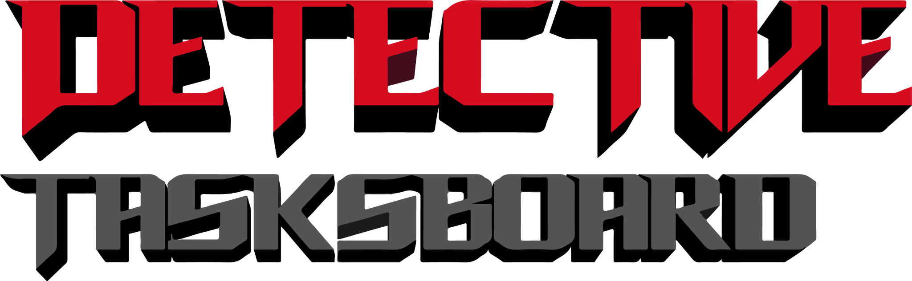

# IF2150-2024-K01-G01-DetectiveTasksboard

# Badges for Project Requirements




## Deskripsi Singkat

Detective Tasksboard adalah perangkat lunak yang dirancang untuk membantu lawyer dalam mengelola berbagai kasus hukum yang ditangani secara efisien dan terstruktur. Dengan perangkat lunak ini, pengelolaan data hukum menjadi lebih mudah, cepat, dan akurat.

## Instalasi Dependensi
Untuk menginstal perangkat lunak, ikuti langkah-langkah berikut:

1. Clone repository:
   ```bash
   git clone https://github.com/fathurwithyou/IF2150-2024-K01-G01-DetectiveTasksboard.git
   cd IF2150-2024-K01-G01-DetectiveTasksboard
   ```
2. Instalasi Dependensi: Pastikan Anda sudah menginstal Python. Kemudian jalankan perintah berikut:
   ```bash
   pip install -r requirements.txt
   ```
## Cara Menjalankan Program
Setelah semua dependensi terinstal dan directory berada di dalam IF2150-2024-K01-G01-DetectiveTasksboard, jalankan aplikasi dengan perintah:

1. Setelah semua dependensi terinstal, jalankan aplikasi dengan perintah:
   ```bash
   cd src
   python main.py
   ```
   
2. Aplikasi akan berjalan di antarmuka berbasis Flet dengan tampilan responsif dan real-time.

## Daftar Implementasi Modul

| Modul       | Penanggung Jawab             | Snapshot          |
|-------------|-------------------------------|-------------------|
| **Cases**   | Muhammad Fathur Rizky        |   |
| **Victims** | Nathaniel Jonathan Rusli     |  |
| **Suspects**| Dave Daniel Yanni            | |
| **Detectives** | Alvin Christopher         | |
| **Dashboard** | Benedict Presley           | |


## Daftar Tabel Basis Data

| Nama Tabel       | Atribut                                                                 |
|-------------------|-------------------------------------------------------------------------|
| **cases**         | id, judul, status, tanggal_mulai, tanggal_selesai, perkembangan_kasus, catatan |
| **detective_cases** | id_detective, id_kasus                                               |
| **detectives**    | id, nama, nik                                                         |
| **suspect_cases**  | id_suspect, id_kasus                                                 |
| **suspects**      | id, nama, foto, nik, usia, jk, catatan_kriminal                       |
| **victim_cases**   | id_victim, id_kasus                                                  |
| **victims**       | id, nama, foto, nik, usia, jk, hasil_forensik                         |

